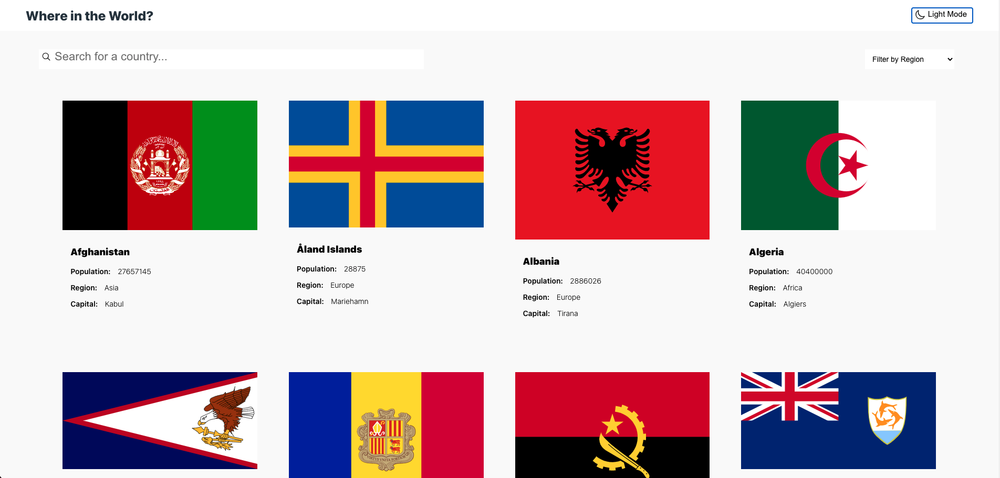
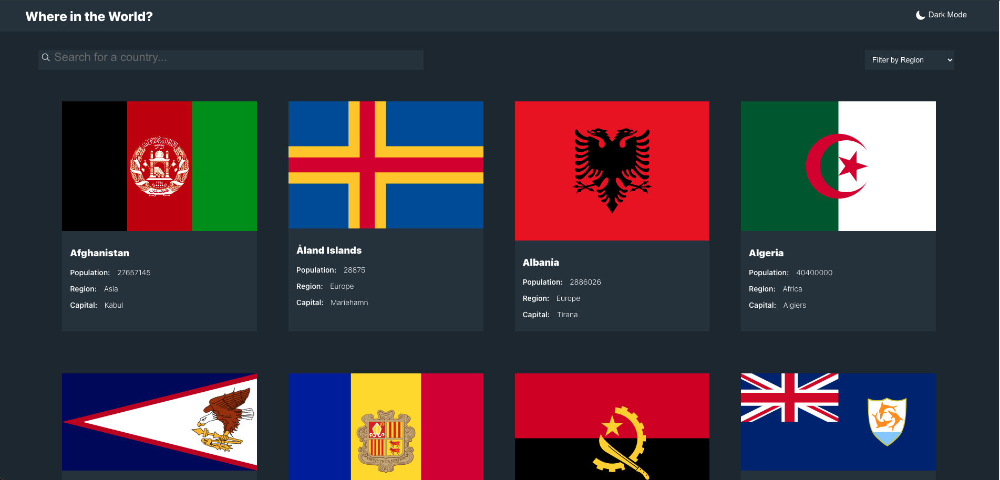
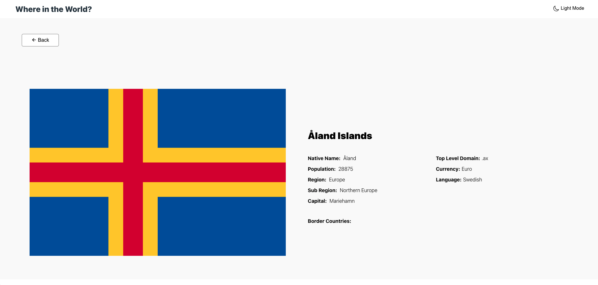

# Countries Rest

## Table of contents

- [Overview](#overview)
  - [The challenge](#the-challenge)
  - [Screenshot](#screenshot)
  - [Links](#links)
  - [Built with](#built-with)
  - [What I learned](#what-i-learned)
  - [Useful resources](#useful-resources)
- [Author](#author)

## Overview

### The Challenge

Users should be able to:

See all countries from the API on the homepage
Search for a country using an input field
Filter countries by region
Click on a country to see more detailed information on a separate page
Click through to the border countries on the detail page
Toggle the color scheme between light and dark mode (optional)

### Screenshots

Countries (Light Mode)

Countries (Dark Mode)

Country Details

### Links

- Live Site URL: [Demo](https://country-flags-react.netlify.app)

## My process

### Built with

- [React](https://reactjs.org/) - JS library
- Flexbox

### What I learned

Utilizing Context Api to pass data through components, without having to pass it as a prop through each individual component. I used Context to setup a theme for light and dark mode.

### Useful resources

- [Example resource 1](https://reactjs.org/docs/context.html) - This helped me setup Context in my app. As I was also using context for to setup a theme, the examples were helpful to my ownw ap.

## Author

- Website - [Michael Takeuchi](https://mmtakeuchi.github.io/)
